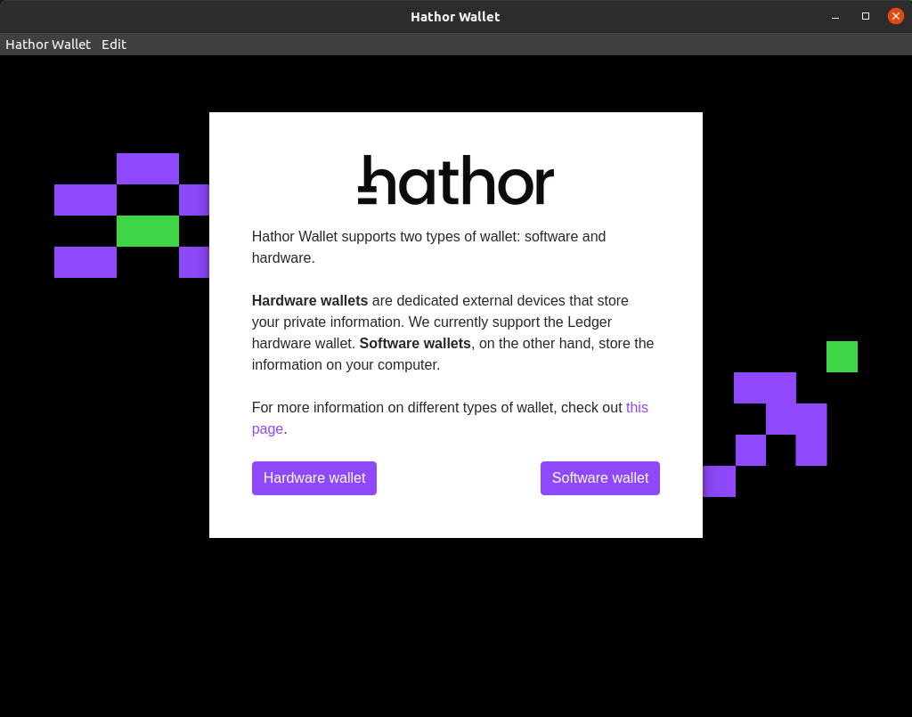
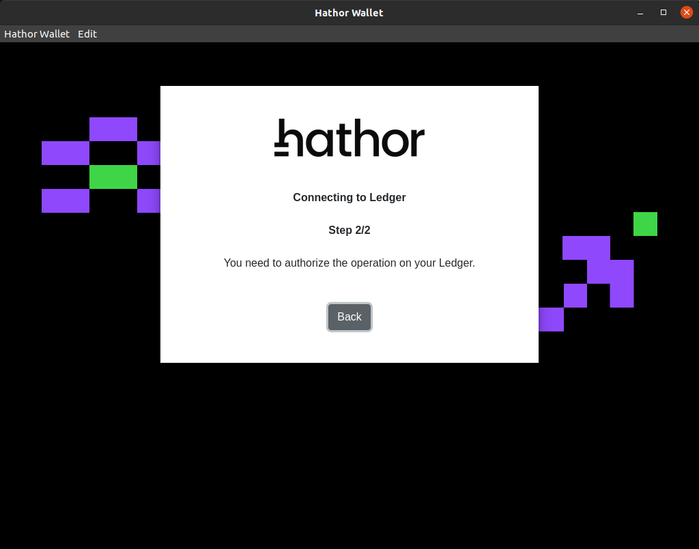
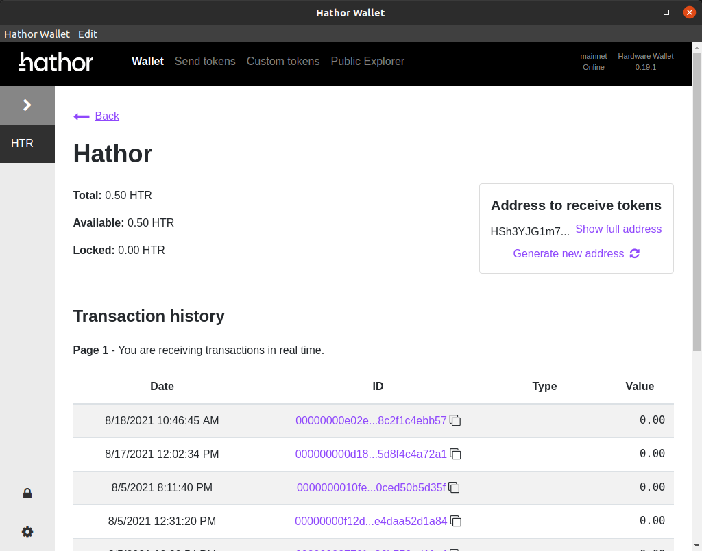
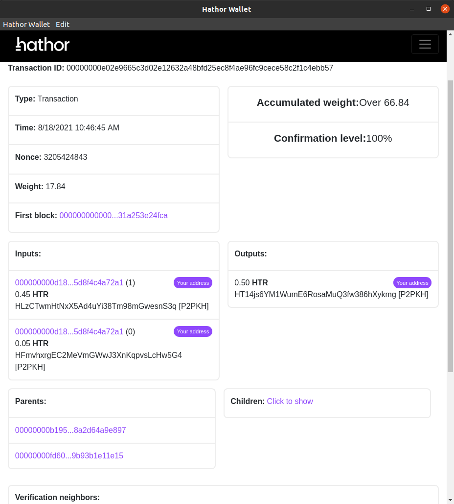
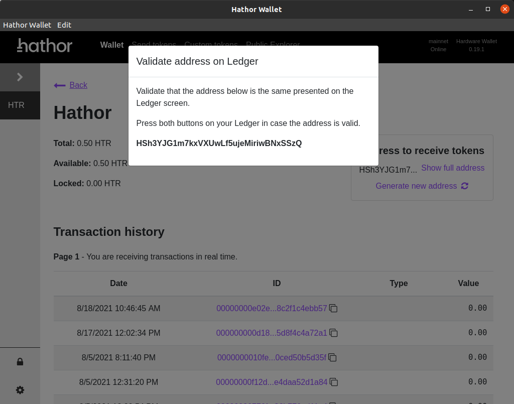
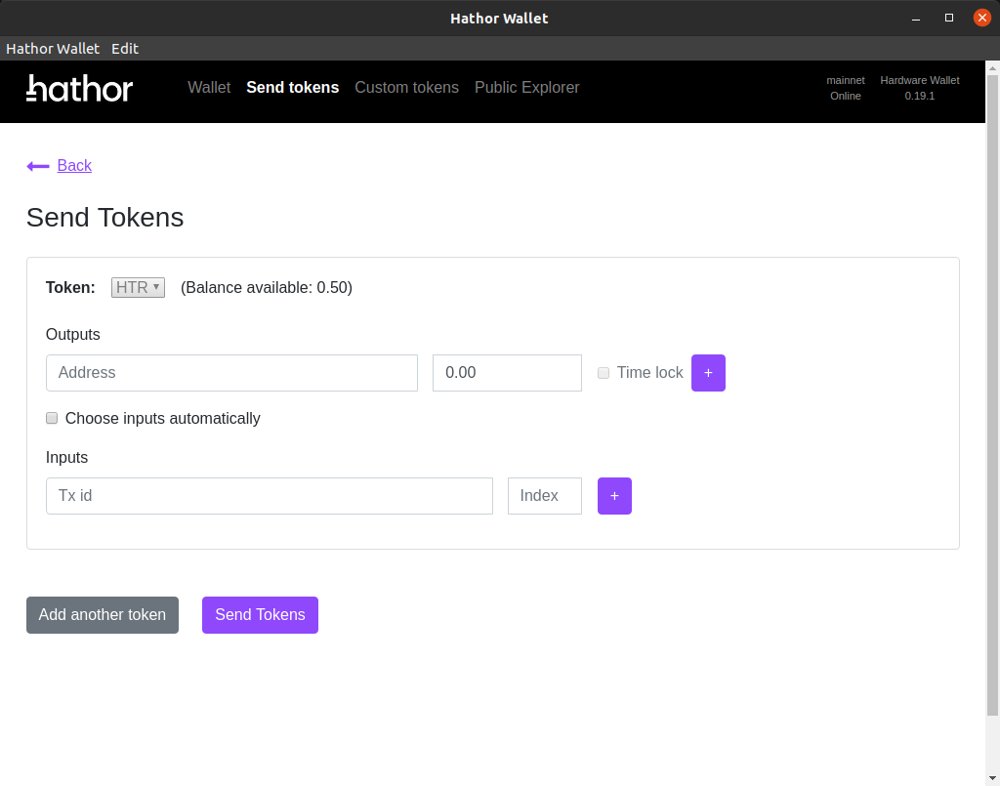

# Wallet Desktop

## Overview

We will teach how to connect a ledger Nano S device with hathor wallet and how to operate the main features of the wallet with the ledger device.

Hathor desktop wallet features with ledger device:

- View TX history
- View TX info
- View public address to receive tokens
- Send HTR Tokens

## Connect

First the device should be connected to the PC and then we should open the wallet (on the PC) and the hathor app (on Nano S).

Once you get to the screen above choose `Hardware wallet` and wait with the hathor app open, the wallet will find the device and check if the hathor app is open.

When the wallet finds the Nano S the second step will begin, the wallet will ask permission to access the wallet public key.

To confirm access, go to the `Approve` screen on the Nano S and press with both buttons.

Now the wallet will load your addresses and transaction history, on the next screen you will be ready to send and receive HTR tokens.

## View TX History

The `Wallet` main screen has a list of previous transactions with basic info on the transaction and a link to view transaction info.

Information on transaction:

- Date and time of the TX
- Id of the transaction (with link to tx info page)
- Type (Effect on wallet balance: send, receive or no effect)
- Value (of the effect on wallet balance)

This list paginates and will go on to the first transaction found on the wallet.

## View TX Info

By clicking on the TX id on the `View TX History` a page with all information on the transaction opens.

Here you can check any information pertaining to the transaction.

## View Public Address

To receive tokens the sender must input an address to send the tokens.

Your wallet has many addresses, if you want to get one to receive tokens you need to:

- On the `Wallet` main screen upper right corner there is a box with the current address
- Click on "Show full address" to show the complete address, check your ledger device
- On the ledger device a prompt to verify the address will appear, you should verify that the address on the screen matches the address on the device.
- After checking the address you must click with both buttons on the `Verify` screen (on the ledger device)

Any errors on the address will make you loose your tokens, only trust addresses that match the ledger generated address.

## Send HTR Tokens

Go to the "Send Tokens" screen and here you can enter which outputs your transaction is going to have.

Output info required:

- Destination address
- Value

You can add up to 255 outputs for any transaction and time lock is disabled for ledger transactions.
Remember: The sum of the outputs values must be equal or less than your available balance.

Now we need to enter from where we will spend the tokens, this can be done automatically in which case the wallet will select the UTXOs that can match the values of the outputs,
or you can choose inputs manually, in which case you will need to provide for each input:

- Tx id
- Output index (which output from Tx id will be spent)

The transaction will not be sent if the inputs total value do not match the outputs total value.
If the inputs total value exceeds the outputs total value the wallet will generate a change output with the remainder of the tokens.
(Ledger will verify that the output belongs to your wallet if it exists, so you can focus on confirming the outputs you intend to send)

OBS: Only HTR (Hathor native token) can be sent with the ledger device.

Once all inputs and outputs are setup, the wallet will send this information to the Nano S and it will ask for your confirmation.

First you will need to confirm each output, remember to check the address and values.
If all outputs are confirmed, the device will ask your permission to sign the transaction,
if confirmed, you will need to wait for the signing process to be done.
(You can also exit while the signing is ongoing, making the transaction fail)

The wallet will get the sign information and send the transaction, after which you will be directed to the `Wallet` screen.
